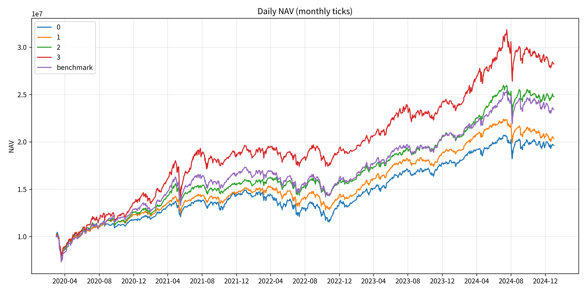
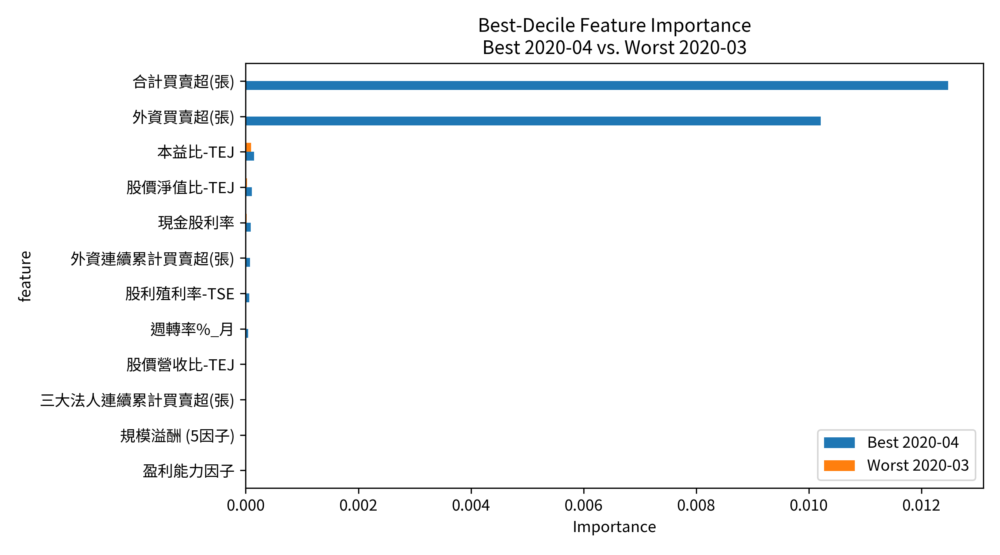
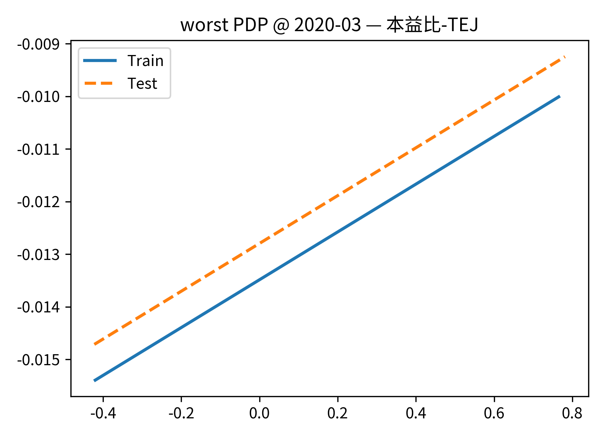
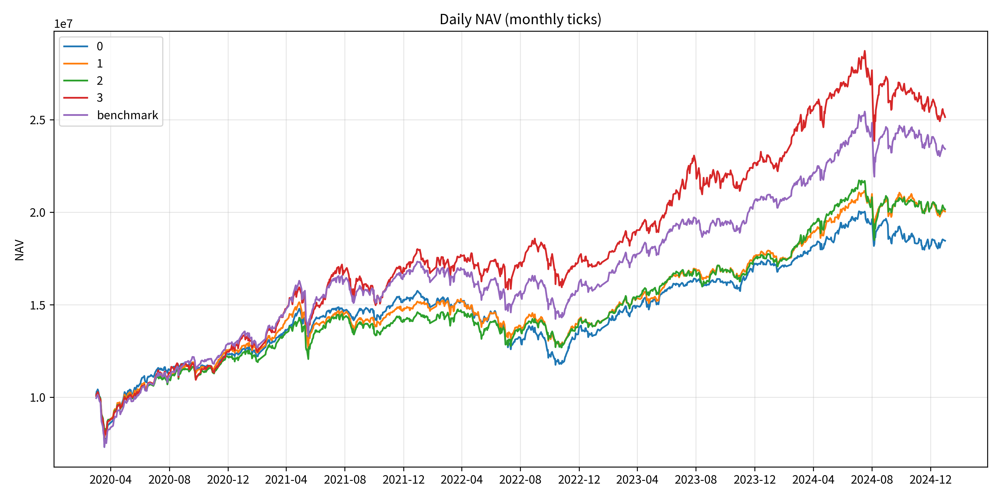
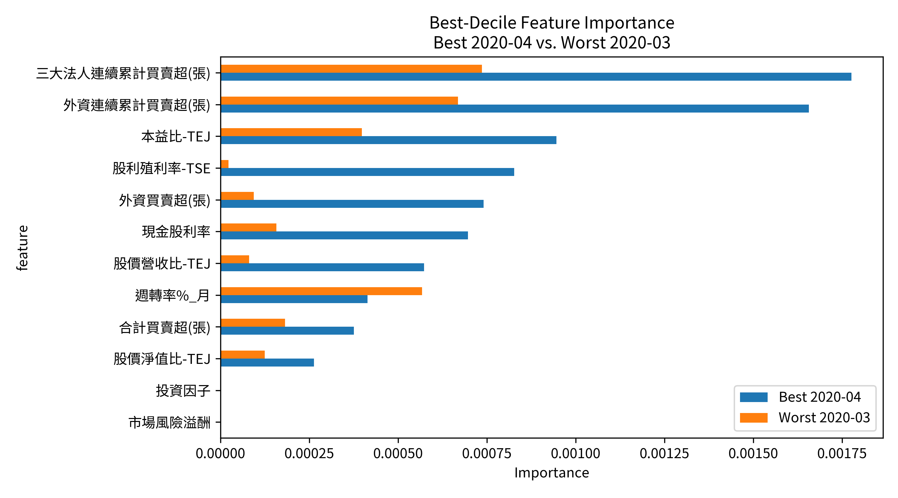

# 月頻選股策略說明

## 1. 策略目標
此策略目標是建立一個月頻的量化選股系統。核心思想是結合 **價值因子 (Value Factors)** 與 **籌碼因子 (Chips Factors)**，篩選出基本面穩健、且資金流向積極的股票，並利用機器學習模型預測其下一期的報酬表現，最終建立一個具備持續產生超額報酬 (Alpha) 能力的投資組合。

---
## 2. 流程

回測流程由以下幾個主要模組構成，依序執行：

1.  **資料爬取 (`web_crawler.py`)**: 從台灣證券交易所 (TWSE) 爬蟲與台灣經濟新報 (TEJ) 獲取價量、財務與籌碼數據。
2.  **資料處理 (`data_process.py`)**: 整合多來源數據，計算還原權值股價，並合併成給模型訓練用的月頻特徵檔 `merged_monthly.csv`。
3.  **模型訓練與預測 (`lasso_model.py`, `xg_boost_model.py`)**: 以擴充視窗方式每月重新訓練模型，預測股票下個月的報酬。
4.  **回測與績效分析 (`backtest.py`)**: 根據模型預測分數建立投資組合，模擬交易並計算完整績效指標。

---
## 3. 資料說明

本專案的數據基礎由以下幾個部分構成：

*   **台股每日交易資料 (`twse_miindex_allbut0999_daily.parquet`)**
    *   **來源**: `web_crawler.py` 爬取自台灣證券交易所。
    *   **內容**: 包含台股市場每日未經調整的開、高、收、低價。
*   **TEJ 資料 (`tej_apiprcd_long_2020-01-01_2025-11-04.parquet`)**
    *   **來源**: TEJ。
    *   **內容**: 只需要其中的 **股價調整因子 (`adjfac`)**，用來計算還原股價。
*   **每日籌碼資料 (`20251104011454.csv`)**
    *   **來源**: TEJ。
    *   **內容**: 包含每日三大法人的買賣超、連續買賣超等資訊。
*   **月頻財務資料 (`20250305084429_close.csv`)**
    *   **來源**: TEJ。
    *   **內容**: 包含月頻的本益比、股價淨值比、股利率等價值因子。
*   **月頻市場因子 (`20250305064046_factor.csv`)**
    *   **來源**: TEJ。
    *   **內容**: 包含 Fama-French 五因子等學術上常用的市場因子。

---
## 4. 資料處理流程

所有原始資料透過 `data_process.py` 進行了處理與整合，主要步驟如下：

1.  **股價還原調整**:
    *   合併每日交易資料與 TEJ 的調整因子 (`adjfac`)。
    *   計算還原權值的開、高、收、低價，產生 `data/twse_miindex_stock_only_adj.parquet`，以消除配股配息對價格造成的影響。
2.  **日頻轉月頻**:
    *   將還原後的日頻股價聚合成月頻資料（取每月最後一筆）。
    *   根據月收盤價計算**月報酬**，這是後續模型預測的目標 (`next_return`)。
3.  **籌碼資料聚合**:
    *   將每日的法人買賣超數據，以月為單位進行加總，得到月買賣超。
    *   將連續買賣超數據，取每月最後一天的值。
4.  **最終特徵合併**:
    *   將處理好的月頻報酬、月頻籌碼、月頻財務、月頻市場因子，四種資料依照「股票代號」和「年月」進行合併。
    *   產出最終供給模型使用的特徵檔 `merged_monthly.csv`。
5.  **資料清洗**:
    *   為了確保模型訓練的穩定性，過濾掉財報資訊不完整與時間序列中資料不完整的股票，確保每支股票在回測期間內都有完整的月份數據。

---

## 5. 策略說明與因子選擇

本策略的核心假設是，股價的驅動力來自於**基本面價值**與**市場籌碼**的結合。因此，我們選用的特徵主要分為以下兩大類：

### 5.1. 價值因子

這類因子用來衡量一家公司的基本面健全程度與市場評價的關係，目的是找出體質良好、營運穩健的公司，藉此反映企業的獲利能力、資產價值表現。

-   `本益比-TEJ`
-   `股價淨值比-TEJ`
-   `股價營收比-TEJ`
-   `股利殖利率-TSE`
-   `現金股利率`

### 5.2. 籌碼/動能因子

這類因子反映了市場參與者（特別是外資）的行為與資金流向，用來捕捉市場的關注度與趨勢。

-   `週轉率%_月`
-   `外資買賣超(張)`
-   `合計買賣超(張)`
-   `外資連續累計買賣超(張)`
-   `三大法人連續累計買賣超(張)`

### 5.3. 市場因子

除了針對個股的特徵外，我們也納入了學術界常用的 Fama-French 風格市場因子。

-   `市場風險溢酬`
-   `規模溢酬 (5因子)`
-   `淨值市價比溢酬`
-   `動能因子`
-   `投資因子`
-   `盈利能力因子`

---
## 6. 模型介紹

為了從高維度的特徵中學習並進行預測，本策略選用了一個線性模型 (Lasso) 和一個非線性模型 (XGBoost) 作為核心。

### 6.1. Lasso

- **簡介**

  Lasso 是一種線性迴歸模型，它在傳統的最小平方法基礎上增加了一個 **L1 懲罰項**。這個懲罰項的關鍵特性是能夠將不重要的特徵係數「壓縮」至零，從而達到 **特徵篩選** 的效果。這有助於建立一個更簡潔、可解釋性更強的模型，特別適合用在高維特徵的場景。

- **目標函數**

  模型最小化預測誤差與 L1 懲罰項的和：

$$
\min_{\beta} \left\lbrace \frac{1}{2n} \sum_{i=1}^{n} (y_i - x_i^{T}\beta)^2 + \alpha \sum_{j=1}^{p} |\beta_j| \right\rbrace
$$

  其中：
  - $\frac{1}{2n} \sum_{i=1}^{n} (y_i - x_i^{T}\beta)^2$：預測誤差（最小化殘差平方和）
  - $\alpha$：整體懲罰強度（越大代表約束越強，越多係數會變為 0）
  - $\sum_{j=1}^{p} |\beta_j|$：L1 懲罰項，促使模型變得稀疏。

- **直覺說明**

  Lasso 的核心在於 L1 懲罰的「菱形」約束，這使得模型在優化過程中，解更容易落在座標軸上，從而讓某些特徵的係數 $\beta_j$ 剛好等於 0。這意味著模型會告訴我們哪些因子在線性層面上是相對不重要的。

### 6.2. XGBoost

- **簡介**

  XGBoost 屬於樹模型，每一棵樹都是利用二元切割（binary split）的方式，根據特徵值來劃分資料區間。不同的是，它不只訓練一棵樹，而是不斷地沿著「最小化損失函數」的梯度方向，逐步新增新的樹，每一棵新樹都用來修正前一輪的預測誤差。使模型能有效捕捉非線性關係與特徵交互作用。

- **模型結構**

  模型由多棵樹組成，預測值為：

$$
\hat{y}_i = \sum_{k=1}^{K} f_k(x_i), \quad f_k \in \mathcal{F}
$$

  其中每個 $f_k$ 是一棵決策樹，整體預測是所有樹輸出的加總。

- **目標函數（含正則化）**

  在第 $t$ 輪訓練時，模型會尋找一棵新樹 $f_t(x)$ 來最小化：

$$
\text{Obj}^{(t)} =
\sum_{i=1}^{n} l\left(y_i, \hat{y}_i^{(t-1)} + f_t(x_i)\right) + \Omega\left(f_t\right)
$$

  其中 $l$ 為損失函數（如 MSE），$\Omega(f_t)$ 控制模型複雜度：

$$
\Omega(f_t) = \gamma T + \frac{1}{2}\lambda \sum_{j=1}^{T} w_j^2 + \alpha \sum_{j=1}^{T} |w_j|
$$

  - $T$：葉節點數（越多越複雜）
  - $w_j$：第 $j$ 個葉子的輸出值
  - $\lambda$：類似 L2 正則化
  - $\alpha$：類似 L1 正則化
  - $\gamma$：懲罰額外分裂，抑制過度成長

- **直覺說明**

  XGBoost 同時考慮「預測誤差」與「模型簡潔性」：

$$
\text{準確度} \;+\; \text{懲罰複雜度}
$$

  - **L1**：可讓不重要的葉子輸出變成 0
  - **L2**：讓所有葉子輸出變小，降低過度擬合風險
  - **$\gamma$**：只有當分裂帶來實質收益才會繼續分裂

---
## 7. 回測設定

回測框架 (`backtest.py`) 模擬了一個貼近真實交易的場景，其核心設定如下：

*   **投資組合:**
    *   **分組數量 (`n_quantiles`):** `4` 組（將所有股票依模型預測報酬由高到低切成四等份，即 quartile）。
    *   **初始資金 (`initial_capital_per_bucket`):** 每組獨立配置 `10,000,000` 元。
    *   **權重分配:** 每個投資組合內採**等權重 (Equal Weight)** 配置。

*   **再平衡策略:**
    *   **頻率:** **月頻**。於每個月的第一個交易日，根據上個月底產生的新選股名單進行再平衡。
    *   **交易執行:** 模擬於**開盤價**進行交易。回測邏輯已處理隔夜 (`close-to-open`) 與盤中 (`open-to-close`) 的價格變化，並在開盤時扣除交易成本。非再平衡日則以收盤價計算報酬。

*   **交易成本 (`CostConfig`):**
    *   **買入手續費 (`commission_buy`):** `0.1425%`
    *   **賣出手續費 (`commission_sell`):** `0.1425%`
    *   **賣出交易稅 (`tax_sell`):** `0.3%`
    *   **滑價 (`slippage`):** `0%`（目前設定為理想情況，無滑價）

*   **績效計算:**
    *   **年化天數 (`ann`):** `252` 天（用於計算夏普比率等年化指標）。

---
## 8. 模型回測與分析

### 8.1 Lasso 回測

**績效摘要**

| 分組 | mean (日) | std (日) | sharpe | annual_return | total_return | CAGR | MDD(%) | Calmar |
|:----------|---------:|---------:|---------:|----------------:|---------------:|---------:|----------:|---------:|
| 0         | 0.000611 | 0.010340 | 0.937689 | 0.166341 | 0.931188 | 0.150634 | -0.291022 | 0.517604 |
| 1         | 0.000633 | 0.008990 | 1.117520 | 0.172855 | 1.013190 | 0.160881 | -0.255061 | 0.630753 |
| 2         | 0.000805 | 0.009274 | 1.377830 | 0.224777 | 1.459260 | 0.211486 | -0.236648 | 0.893674 |
| 3         | 0.000944 | 0.011880 | 1.261540 | 0.268466 | 1.805270 | 0.245969 | -0.231594 | 1.062070 |
| benchmark | 0.000783 | 0.010799 | 1.150880 | 0.217998 | 1.352650 | 0.200094 | -0.278603 | 0.718204 |

**淨值曲線**

**特徵重要性分析**

**績效最好的分組部分依賴分析 (PDP)**

*最佳月份*

*最差月份*

### 8.2 XGBoost 回測

**績效摘要**

| 分組 | mean (日) | std (日) | sharpe | annual_return | total_return | CAGR | MDD(%) | Calmar |
|:----------|---------:|---------:|---------:|----------------:|---------------:|---------:|----------:|---------:|
| 0         | 0.000551 | 0.009641 | 0.907539 | 0.148960 | 0.814884 | 0.135497 | -0.299006 | 0.453160 |
| 1         | 0.000626 | 0.009218 | 1.078470 | 0.170893 | 0.992516 | 0.158329 | -0.237451 | 0.666784 |
| 2         | 0.000633 | 0.009710 | 1.035030 | 0.172905 | 0.997566 | 0.158954 | -0.232035 | 0.685043 |
| 3         | 0.000843 | 0.011907 | 1.124550 | 0.236732 | 1.489960 | 0.214696 | -0.245768 | 0.873569 |
| benchmark | 0.000783 | 0.010799 | 1.150880 | 0.217998 | 1.352650 | 0.200094 | -0.278603 | 0.718204 |

**淨值曲線**

**特徵重要性分析**

**績效最好的分組部分依賴分析 (PDP)**

*最佳月份*

*最差月份*

---
## 9. 模型比較

### 9.1 模型差異

| 模型 | 類型 | 特性 | 適用情境 |
|------|------|------|----------|
| **Lasso (L1 Regularized Regression)** | 線性模型 | 具備特徵選擇能力，僅保留少數關鍵變數 | 資料維度高但樣本量有限、關係近似線性時表現佳 |
| **XGBoost (Gradient Boosting Trees)** | 非線性樹模型 | 能捕捉變數間的交互作用與非線性關係 | 樣本量大、特徵豐富且非線性強的情況下表現優異 |

---

### 9.2 為什麼在此策略中 Lasso 效果優於 XGBoost

1. **資料規模有限、樹模型不易發揮**

   策略使用月頻資料（樣本約 2.8 萬筆、16 個特徵），對於需要大量樣本以建立穩定樹結構的 XGBoost 而言，資料量偏小。在此情況下，模型在過度分裂時容易 **過擬合**，導致預測結果穩定性下降。相對地，Lasso 以簡潔的線性結構搭配 L1 正則化，能有效控制模型複雜度並維持泛化能力。

2. **L1 正則化帶來特徵選擇效果**

   Lasso 會自動將影響力較弱的變數係數壓為 0，有助於過濾雜訊特徵，使模型專注於主要因子，例如「合計買賣超(張)」、「外資買賣超(張)」等籌碼因子。這使得 Lasso 的預測結果在經濟意涵上更清晰，也更具穩定性。

3. **XGBoost 的正則化方向不同**

   雖然 XGBoost 內建 L1、L2 與 $\gamma$ 等防止過擬合的機制，但其正則化主要作用在 **樹的結構與葉子輸出** 上，目的是抑制極端分裂或不合理的葉子值，使預測更平滑。然而，這樣的機制 **不會完全移除特徵**，同一變數仍可能在不同層級重複出現，導致模型保留雜訊訊號。相較之下，Lasso 的 L1 懲罰能直接將不重要特徵係數壓為 0，更適合樣本有限、特徵共線性高的金融資料。

---

### 9.3 模型績效比較

| 模型 | Sharpe Ratio | CAGR | MDD(%) | Calmar Ratio |
|------|---------------|------|--------|---------------|
| **Lasso** | **1.26** | **0.25** | **-0.23** | **1.06** |
| XGBoost | 1.12 | 0.21 | -0.25 | 0.87 |

---

### 9.4 結論

> 在本研究中，Lasso 表現優於 XGBoost，主要原因：
> - 資料樣本有限的情況下，使樹模型難以穩定學習非線性結構。
> - L1 正則化能有效抑制雜訊與過擬合，強化模型穩定性。
> - 且模型可解釋性高，能清楚揭示主要因子。
>
> 未來若能納入更多樣本，並增加更多具交互關係的特徵（如技術指標、交互項或對數／平方轉換等），XGBoost 可能會發揮得更好。

---

## 附錄 A. Lasso 模型可解釋性分析 — 最佳與最差月份特徵重要性比較

以下表格顯示 Lasso 在「**最佳月份 (2020-04)**」與「**最差月份 (2020-03)**」下的 Permutation Importance 結果，能觀察到模型在多空市場中的判斷轉變。

### 最佳月份 (2020-04)

| 排名 | 特徵 | 重要性 (importance_best) |
|:----:|:--------------------|------------------:|
| 1 | 合計買賣超(張) | 0.012473 |
| 2 | 外資買賣超(張) | 0.010208 |
| 3 | 本益比-TEJ | 0.000150 |
| 4 | 股價淨值比-TEJ | 0.000106 |
| 5 | 現金股利率 | 0.000088 |
| 6 | 外資連續累計買賣超(張) | 0.000078 |
| 7 | 股利殖利率-TSE | 0.000061 |
| 8 | 週轉率%_月 | 0.000042 |
| 9 | 股價營收比-TEJ | 0.000009 |

其餘特徵為 0。

### 最差月份 (2020-03)

| 排名 | 特徵 | 重要性 (importance_worst) |
|:----:|:--------------------|------------------:|
| 1 | 本益比-TEJ | 0.000096 |
| 2 | 股價淨值比-TEJ | 0.000025 |
| 3 | 現金股利率 | 0.000016 |
| 4 | 股利殖利率-TSE | 0.000006 |
| 5 | 外資連續累計買賣超(張) | 0.000003 |
| 6 | 外資買賣超(張) | 0.000001 |
| 7 | 週轉率%_月 | 0.000000 |
| 8 | 股價營收比-TEJ | 0.000000 |
| 9 | 合計買賣超(張) | 0.000000 |

其餘特徵為 0。

### 說明

- 在 **2020-04（多頭）** 中，模型明顯依賴 **籌碼因子**（合計買賣超、外資買超），顯示「資金流向」主導市場。
- 而在 **2020-03（空頭）** 中，**估值因子**（本益比、股價淨值比）變得相對重要，模型轉而關注基本面訊號。

這顯示 Lasso 能根據市場狀態自動調整決策邏輯，具備一定的適應性。

---

## 附錄 B. XGBoost 模型可解釋性分析 — 最佳與最差月份特徵重要性比較

以下表格顯示 XGBoost 模型在「**最佳月份 (2020-04)**」與「**最差月份 (2020-03)**」的 Permutation Importance 結果，可觀察模型在不同市場狀態下的判斷重點變化。

### 最佳月份 (2020-04)

| 排名 | 特徵 | 重要性 (importance_best) |
|:----:|:--------------------|------------------:|
| 1 | 三大法人連續累計買賣超(張) | 0.001776 |
| 2 | 外資連續累計買賣超(張) | 0.001656 |
| 3 | 本益比-TEJ | 0.000946 |
| 4 | 股利殖利率-TSE | 0.000826 |
| 5 | 外資買賣超(張) | 0.000740 |
| 6 | 現金股利率 | 0.000697 |
| 7 | 股價營收比-TEJ | 0.000573 |
| 8 | 週轉率%_月 | 0.000413 |
| 9 | 合計買賣超(張) | 0.000375 |
| 10 | 股價淨值比-TEJ | 0.000263 |

### 最差月份 (2020-03)

| 排名 | 特徵 | 重要性 (importance_worst) |
|:----:|:--------------------|------------------:|
| 1 | 三大法人連續累計買賣超(張) | 0.000735 |
| 2 | 外資連續累計買賣超(張) | 0.000668 |
| 3 | 週轉率%_月 | 0.000567 |
| 4 | 本益比-TEJ | 0.000398 |
| 5 | 合計買賣超(張) | 0.000181 |
| 6 | 現金股利率 | 0.000157 |
| 7 | 股價淨值比-TEJ | 0.000124 |
| 8 | 外資買賣超(張) | 0.000094 |
| 9 | 股價營收比-TEJ | 0.000080 |
| 10 | 股利殖利率-TSE | 0.000022 |

### 說明

- 不論是 **市場上漲（2020-04）** 或 **市場下跌（2020-03）**，模型皆明顯聚焦於 **籌碼與流動性因子**（如三大法人、外資連續買超、週轉率等），顯示資金流向對 XGBoost 判斷最具影響力。
